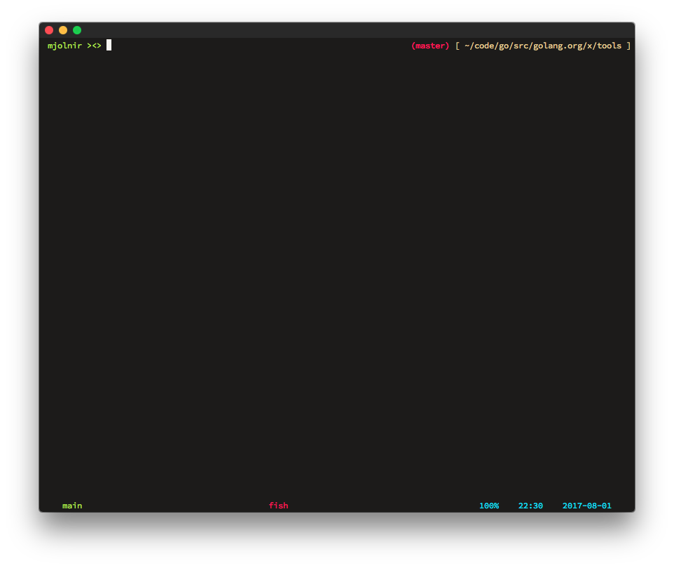
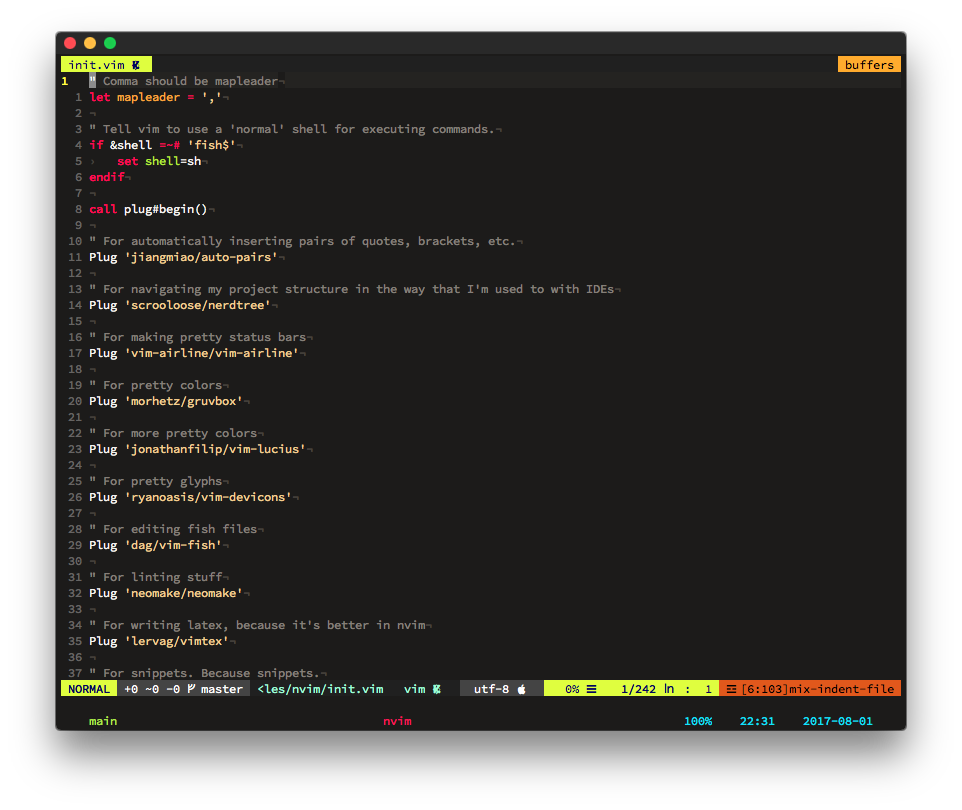
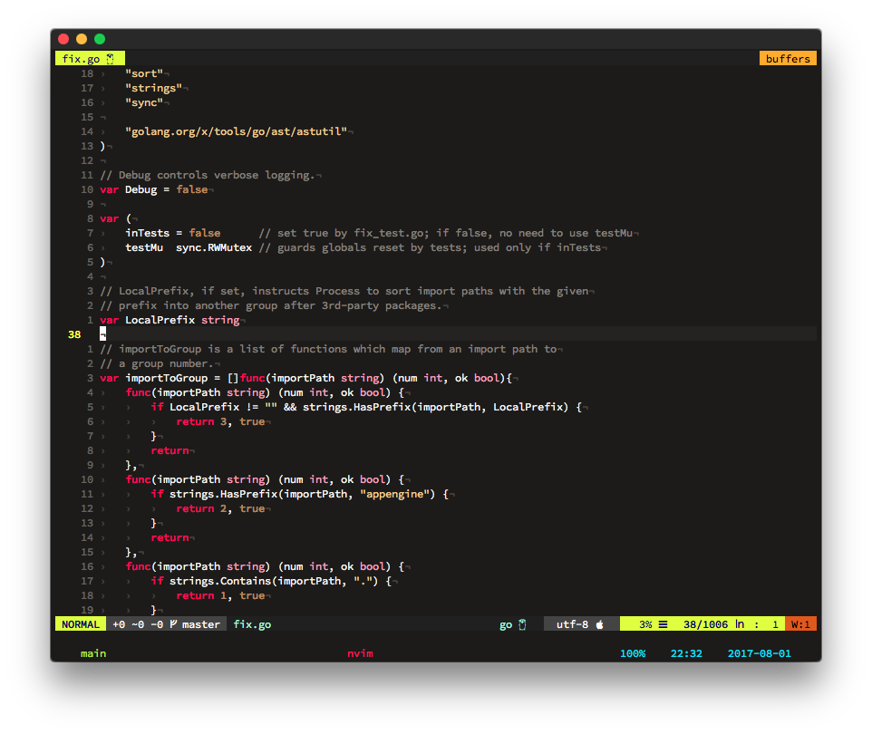
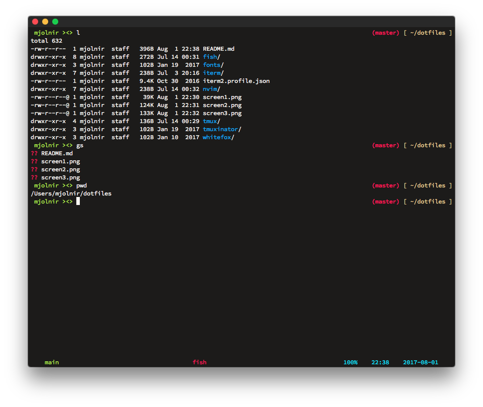

# dotfiles

This is a repo where I version control all of my dotfiles. Currently, I have a
custom iTerm2 color scheme inspired by the [badwolf
colorscheme](https://github.com/sjl/badwolf). All the other colors that are set
in Tmux and Fish simply use the ANSI colors and so they take on the colors of
the iTerm2 colorscheme. Vim uses the real badwolf colorscheme. Here are some
screenshots:

